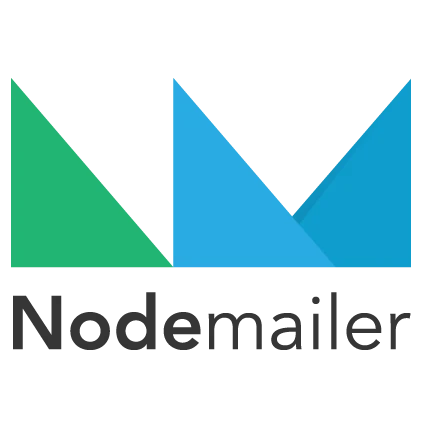

<div style="text-align: center;">
  
</div>

[PT](#pt-br) - <a href="#pt-br" title="English is not available yet" disable style="cursor: default; color: gray;">EN</a>

#### PT-BR
O My Finances é um site para controle de finanças pessoais open source e com objetivo de ser de fácil utilização e bem otimizado.

Este repositório é da API do My Finances, é ela que se responsabiliza pela autenticação do usuário e manipulação direta dos serviços de banco de dados e email.

Tabela de conteúdos
=
- [Tabela de conteúdos](#tabela-de-conteúdos)
  - [Instalação](#instalação)
  - [Como rodar](#como-rodar)
  - [Rotas](#rotas)
  - [Status](#status)
    - [Features](#features)
  - [Licença](#licença)
  - [Tecnologias utilizadas](#tecnologias-utilizadas)
    - [Bibliotecas populares utilizadas](#bibliotecas-populares-utilizadas)
  - [Para devs](#para-devs)

## Instalação

1. Você precisa do [Git](https://git-scm.com) e do [Node.JS](https://nodejs.org/) instalados na sua máquina (recomendo Node >=18.0.0).

```bash
# Clone este repositório
$ git clone <https://github.com/JoaoSCoelho/my-finances-backend>

# Acesse a pasta do projeto no terminal/cmd
$ cd my-finances-backend

# Instale as dependências
$ npm install
```

2. Você precisa ter um servidor mongodb rodando, para isso você pode usar o [MongoDB Atlas](https://www.mongodb.com/atlas), para isso bastar seguir os passos em [Usando MongoDB Atlas](docs/criando-mongodb-on-atlas.md), ou rodar um servidor mongodb localmente na sua máquina: passo a passo para isso em [Rodando MongoDB localmente](docs/instalacao-mongodb-community.md)

## Como rodar

1. Crie um arquivo chamado `.env` na raíz do projeto conforme o padrão em [`.env.example`](.env.example) e defina suas variáveis de ambiente. (variáveis com a palavra `TEST` só são necessárias se for rodar o comando de testes)
   * ❕ **PARA QUEM ESTÁ USANDO O MONGODB ATLAS**: Nas variáveis que for necessário o `MONGO_URI`, lembre-se de substituir `<password>` pela senha do database.

2. Na pasta raíz do projeto, execute:

```bash
# Para rodar o servidor em modo de desenvolvimento, com re-run automático quando arquivos forem alterados
$ npm run dev

# Para criar uma build do projeto em JavaScript
$ npm run build

# Para executar a build do projeto
$ npm run start

# Para executar os testes automatizados funcionais
$ npm run test:functional
```

Agora você já pode acessar: `http://localhost:{ENV.PORT}`

Você pode usar algum programa para testar as [requisições](#rotas), como por exemplo o [Insômnia](https://insomnia.rest/download).

[Insômnia collection](resources/Insomnia_2023-07-29.json) - Coleção de requisições da API no Insômnia

## Rotas
Você pode ver a documentação das rotas da API [aqui](docs/rotas.md)

## Status
> **🚧 Em construção... 🚧 v1.1.0**

### Features

- [x] Autenticação de usuário
- [x] Confirmação de email
- [x] Refresh token
- [x] Cadastro, edição e remoção de contas bancárias
- [x] Cadastro, edição e remoção de transações (Receitas, Despesas e Transferências)
- [ ] Testes automatizados em todas as rotas (em progresso)

## Licença

[MIT](https://choosealicense.com/licenses/mit/)

## Tecnologias utilizadas
<div style="display: inline-block">
  
  
  
  
  
</div>


Node.JS | TypeScript | Express | MongoDB | Jest |

### Bibliotecas populares utilizadas
<div style="display: inline-block">
  
  
  

</div>

BCrypt | JWT | Nodemailer

## Para devs
Para mais detalhes do código do projeto, estrutura de pastas, componentes produzidos, entre outras coisas: entre no arquivo [code-details.md](code-details.md).
