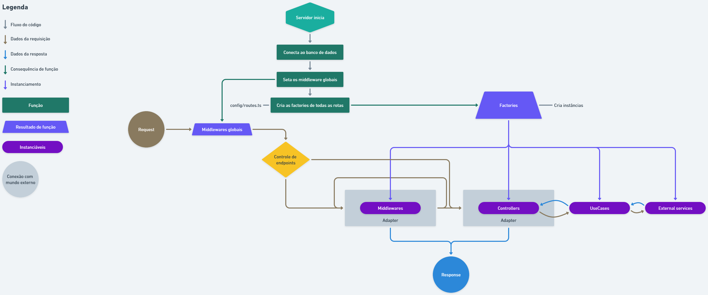

# Documentação do código

[PT](#pt-br) - <a href="#pt-br" title="English is not available yet" disable style="cursor: default; color: gray;">EN</a>

#### PT-BR

Tabela de conteúdos
=
- [Documentação do código](#documentação-do-código)
      - [PT-BR](#pt-br)
- [Tabela de conteúdos](#tabela-de-conteúdos)
  - [Princípios SOLID](#princípios-solid)
  - [Fundamentos do Clean Architecture](#fundamentos-do-clean-architecture)
  - [Fluxograma](#fluxograma)
  - [Entidades e Objetos de valor (Entities and Object Values)](#entidades-e-objetos-de-valor-entities-and-object-values)
  - [Http helpers](#http-helpers)
  - [Templates](#templates)
      - [Controller](#controller)
      - [UseCase](#usecase)
      - [Factory](#factory)
      - [Middleware](#middleware)
      - [Entity](#entity)
      - [ObjectValue](#objectvalue)
      - [Error](#error)
  - [Entendendo o *Either*](#entendendo-o-either)

## Princípios SOLID

<caption>

Imagem de: [DTI Digital](https://www.dtidigital.com.br/blog/adote-principios-solid-boas-praticas-de-programacao)
</caption>

## Fundamentos do Clean Architecture

<caption>

Imagem de: [Stack Exchange](https://softwareengineering.stackexchange.com/questions/357052/clean-architecture-use-case-containing-the-presenter-or-returning-data)
</caption>

## Fluxograma

## Entidades e Objetos de valor (Entities and Object Values)
> ❕ ***SEÇÃO EM CONSTRUÇÃO***

## Http helpers
> ❕ ***SEÇÃO EM CONSTRUÇÃO***

## Templates

#### Controller
> ❕ ***SEÇÃO EM CONSTRUÇÃO***

#### UseCase
> ❕ ***SEÇÃO EM CONSTRUÇÃO***

#### Factory
> ❕ ***SEÇÃO EM CONSTRUÇÃO***

#### Middleware
> ❕ ***SEÇÃO EM CONSTRUÇÃO***

#### Entity
> ❕ ***SEÇÃO EM CONSTRUÇÃO***

#### ObjectValue
> ❕ ***SEÇÃO EM CONSTRUÇÃO***

#### Error
> ❕ ***SEÇÃO EM CONSTRUÇÃO***

## Entendendo o *Either*
> ❕ ***SEÇÃO EM CONSTRUÇÃO***
