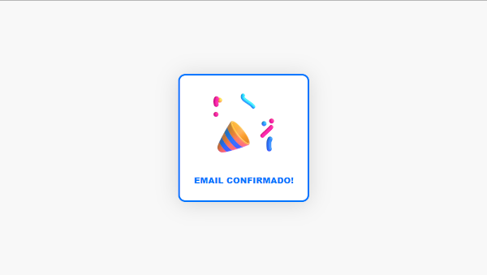

# Rotas

<details>
 <summary><strong>POST</strong> | <code>/api/users</code> | Criação de usuário</summary>

> **Permissões necessárias**: `NENHUMA`

> **Autenticação necessária**: `Nenhuma`


##### Body
```ts
{
  username: string, // Username
  email: string, // Email
  password: string, // Password
  profileImageURL?: string // URL
}
```


##### Response
```ts
// Status 201
{
  user: {
    id: number,
    username: string,
    email: string,
    confirmedEmail: boolean,
    createdTimestamp: number,
    profileImageURL?: string
  },
  accessToken: string,
  refreshToken: string
}
```
</details>

<details>
 <summary><strong>POST</strong> | <code>/api/login</code> | Login</summary>

> **Permissões necessárias**: `NENHUMA`

> **Autenticação necessária**: `Nenhuma`


##### Body
```ts
{
  email: string, // Email
  password: string // Password
}
```


##### Response
```ts
// Status 200
{
  user: {
    id: number,
    username: string,
    email: string,
    confirmedEmail: boolean,
    createdTimestamp: number,
    profileImageURL?: string
  },
  accessToken: string,
  refreshToken: string
}
```
</details>

<details>
 <summary><strong>POST</strong> | <code>/api/users/me/resend/emailconfirmation</code> | Reenviar email de confirmação</summary>

> **Permissões necessárias**: `NENHUMA`

> **Autenticação necessária**: `Bearer`

##### Response
```ts
// Status 200

```
</details>


<details>
 <summary><strong>POST</strong> | <code>/api/auth/refreshtoken</code> | Recriar access token e refresh token</summary>

> **Permissões necessárias**: `NENHUMA`

> **Autenticação necessária**: `Nenhuma`


##### Body
```ts
{
  refreshToken: string,
}
```


##### Response
```ts
// Status 200
{
  accessToken: string,
  refreshToken: string
}
```
</details>

<details>
 <summary><strong>POST</strong> | <code>/api/bankaccounts</code> | Criar conta bancária</summary>

> **Permissões necessárias**: `CONFIRMED_EMAIL`

> **Autenticação necessária**: `Bearer`


##### Body
```ts
{
  name: string, // BankAccountName
  initialAmount: number, // Amount
  imageURL?: string, // URL
}

```


##### Response
```ts
// Status 201
{
  bankAccount: {
    id: string,
    userId: string,
    createdTimestamp: number,
    name: string,
    initialAmount: number,
    imageURL?: string
  }
}
```
</details>

<details>
 <summary><strong>POST</strong> | <code>/api/transactions/incomes</code> | Criar receita</summary>

> **Permissões necessárias**: `CONFIRMED_EMAIL`

> **Autenticação necessária**: `Bearer`


##### Body
```ts
{
  bankAccountId: string, // ID
  description?: string, // TransactionDescription
  gain: number, // NoNegativeAmount
  title: string, // TransactionTitle
}
```


##### Response
```ts
// Status 201
{
  income: {
    id: string,
    bankAccountId: string,
    gain: number,
    createdTimestamp: number,
    title: string,
    description?: string,
  },
  newBankAccountAmount: number
}
```
</details>

<details>
 <summary><strong>POST</strong> | <code>/api/transactions/expenses</code> | Criar despesa</summary>

> **Permissões necessárias**: `CONFIRMED_EMAIL`

> **Autenticação necessária**: `Bearer`


##### Body
```ts
{
  bankAccountId: string, // ID
  description?: string, // TransactionDescription
  spent: number, // NoNegativeAmount
  title: string, // TransactionTitle
}
```


##### Response
```ts
// Status 201
{
  expense: {
    id: string,
    bankAccountId: string,
    spent: number,
    createdTimestamp: number,
    title: string,
    description?: string,
  },
  newBankAccountAmount: number
}
```
</details>

<details>
 <summary><strong>POST</strong> | <code>/api/transactions/transfers</code> | Criar transferência</summary>

> **Permissões necessárias**: `CONFIRMED_EMAIL`

> **Autenticação necessária**: `Bearer`


##### Body
```ts
{
  giverBankAccountId: string, // ID
  receiverBankAccountId: string, // ID
  description?: string, // TransactionDescription
  amount: number, // NoNegativeAmount
  title: string, // TransactionTitle
}
```


##### Response
```ts
// Status 201
{
  expense: {
    id: string,
    giverBankAccountId: string,
    receiverBankAccountId: string,
    amount: number,
    createdTimestamp: number,
    title: string,
    description?: string,
  },
  newGiverBankAccountAmount: number,
  newReceiverBankAccountAmount: number,
}
```
</details>

<details>
 <summary><strong>GET</strong> | <code>/api/confirmemail/:token</code> | Confirmar email</summary>

> **Permissões necessárias**: `NENHUMA`

> **Autenticação necessária**: `Nenhuma`


##### Response
```ts
// Status 200
```

</details>

<details>
 <summary><strong>GET</strong> | <code>/api/users/me</code> | Busca os dados do usuário</summary>

> **Permissões necessárias**: `NENHUMA`

> **Autenticação necessária**: `Bearer`


##### Response
```ts
// Status 200
{
  user: {
    id: string,
    username: string,
    email: string,
    confirmedEmail: boolean,
    createdTimestamp: number,
    profileImageURL?: string
  }
}
```
</details>

<details>
 <summary><strong>GET</strong> | <code>/api/bankaccounts/my</code> | Busca as contas bancárias do usuário</summary>

> **Permissões necessárias**: `NENHUMA`

> **Autenticação necessária**: `Bearer`


##### Response
```ts
// Status 200
{
  bankAccounts: {
    id: string,
    userId: string,
    createdTimestamp: number,
    name: string,
    initialAmount: number,
    imageURL?: string,
    totalAmount: number,
  }[]
}
```
</details>

<details>
 <summary><strong>GET</strong> | <code>/api/transactions</code> | Busca todas as transações do usuário</summary>

> **Permissões necessárias**: `NENHUMA`

> **Autenticação necessária**: `Bearer`


##### Response
```ts
// Status 200
{
  transactions: {
    id: string,
    bankAccountId?: string,
    giverBankAccountId?: string,
    receiverBankAccountId?: string,
    description?: string,
    spent?: number,
    gain?: number,
    amount?: number,
    createdTimestamp: number,
    title: string,
    type: 'expense' | 'income' | 'transfer',
  }[]
}
```
</details>

<details>
 <summary><strong>GET</strong> | <code>/api/transactions/incomes</code> | Busca as transações de receita do usuário</summary>

> **Permissões necessárias**: `NENHUMA`

> **Autenticação necessária**: `Bearer`


##### Response
```ts
// Status 200
{
  incomes: {
    id: string,
    bankAccountId: string,
    description?: string,
    gain: number,
    createdTimestamp: number,
    title: string,
  }[]
}
```
</details>

<details>
 <summary><strong>GET</strong> | <code>/api/transactions/expenses</code> | Busca as transações de despesa do usuário</summary>

> **Permissões necessárias**: `NENHUMA`

> **Autenticação necessária**: `Bearer`


##### Response
```ts
// Status 200
{
  expenses: {
    id: string,
    bankAccountId: string,
    description?: string,
    spent: number,
    createdTimestamp: number,
    title: string,
  }[]
}
```
</details>

<details>
 <summary><strong>GET</strong> | <code>/api/transactions/transfers</code> | Busca as transações de transferência do usuário</summary>

> **Permissões necessárias**: `NENHUMA`

> **Autenticação necessária**: `Bearer`


##### Response
```ts
// Status 200
{
  transfers: {
    id: string,
    giverBankAccountId: string,
    receiverBankAccountId: string,
    description?: string,
    amount: number,
    createdTimestamp: number,
    title: string,
  }[]
}
```
</details>


<details>
 <summary><strong>PUT</strong> | <code>/api/users/me</code> | Atualiza os dados do usuário</summary>

> **Permissões necessárias**: `CONFIRMED_EMAIL`

> **Autenticação necessária**: `Bearer`

##### Body
```ts
{
  email?: string,
  profileImageURL?: string,
  username?: sting,
}
```

##### Response
```ts
// Status 200
{
	updatedUser: {
		id: string,
		username: string,
		email: string,
		confirmedEmail: boolean,
		createdTimestamp: number,
		profileImageURL?: string
	}
}
```
</details>

<details>
 <summary><strong>PUT</strong> | <code>/api/bankaccounts/:id</code> | Atualiza uma conta bancária específica</summary>

> **Permissões necessárias**: `CONFIRMED_EMAIL`

> **Autenticação necessária**: `Bearer`

##### Body
```ts
{
  name?: string,
  imageURL?: string,
  initialAmount?: number,
}
```

##### Response
```ts
// Status 200
{
	bankAccount: {
		id: string,
		userId: string,
		name: string,
		initialAmount: number,
		createdTimestamp: number,
		imageURL?: string,
    totalAmount: number,
	}
}
```
</details>

<details>
 <summary><strong>PUT</strong> | <code>/api/incomes/:id</code> | Atualiza uma receita específica</summary>

> **Permissões necessárias**: `CONFIRMED_EMAIL`

> **Autenticação necessária**: `Bearer`

##### Body
```ts
{
  title?: string,
  gain?: number,
  description?: string,
  bankAccountId?: string,
}
```

##### Response
```ts
// Status 200
{
	updatedIncome: {
		id: string,
		bankAccountId: string,
		title: string,
		gain: number,
		createdTimestamp: number,
    description: string,
	},
  newBankAccountAmount: number
}
```
</details>

<details>
 <summary><strong>PUT</strong> | <code>/api/expenses/:id</code> | Atualiza uma despesa específica</summary>

> **Permissões necessárias**: `CONFIRMED_EMAIL`

> **Autenticação necessária**: `Bearer`

##### Body
```ts
{
  title?: string,
  spent?: number,
  description?: string,
  bankAccountId?: string,
}
```

##### Response
```ts
// Status 200
{
	updatedExpense: {
		id: string,
		bankAccountId: string,
		title: string,
		spent: number,
		createdTimestamp: number,
    description: string,
	},
  newBankAccountAmount: number
}
```
</details>

<details>
 <summary><strong>PUT</strong> | <code>/api/transfers/:id</code> | Atualiza uma transferência específica</summary>

> **Permissões necessárias**: `CONFIRMED_EMAIL`

> **Autenticação necessária**: `Bearer`

##### Body
```ts
{
  title?: string,
  amount?: number,
  description?: string,
  giverBankAccountId?: string,
  receiverBankAccountId?: string,
}
```

##### Response
```ts
// Status 200
{
	updatedTransfer: {
		id: string,
		giverBankAccountId: string,
    receiverBankAccountId: string,
		title: string,
		amount: number,
		createdTimestamp: number,
    description: string,
	},
  newGiverBankAccountAmount: number,
  newReceiverBankAccountAmount: number,
}
```
</details>

<details>
 <summary><strong>DELETE</strong> | <code>/api/bankaccounts/:id</code> | Deleta uma conta bancária</summary>

> **Permissões necessárias**: `CONFIRMED_EMAIL`

> **Autenticação necessária**: `Bearer`

##### Response
```ts
// Status 200
{
  bankAccount: {
    id: string,
    userId: string,
    createdTimestamp: number,
    name: string,
    initialAmount: number,
    imageURL?: string
  }
}
```
</details>

<details>
 <summary><strong>DELETE</strong> | <code>/api/transactions/incomes/:id</code> | Deleta uma receita</summary>

> **Permissões necessárias**: `CONFIRMED_EMAIL`

> **Autenticação necessária**: `Bearer`

##### Response
```ts
// Status 200
{
  newBankAccountAmount: number
}
```
</details>

<details>
 <summary><strong>DELETE</strong> | <code>/api/transactions/expenses/:id</code> | Deleta uma despesa</summary>

> **Permissões necessárias**: `CONFIRMED_EMAIL`

> **Autenticação necessária**: `Bearer`

##### Response
```ts
// Status 200
{
  newBankAccountAmount: number
}
```
</details>

<details>
 <summary><strong>DELETE</strong> | <code>/api/transactions/transfers/:id</code> | Deleta uma transferência</summary>

> **Permissões necessárias**: `CONFIRMED_EMAIL`

> **Autenticação necessária**: `Bearer`

##### Response
```ts
// Status 200
{
  newGiverBankAccountAmount: number,
  newReceiverBankAccountAmount: number,
}
```
</details>
